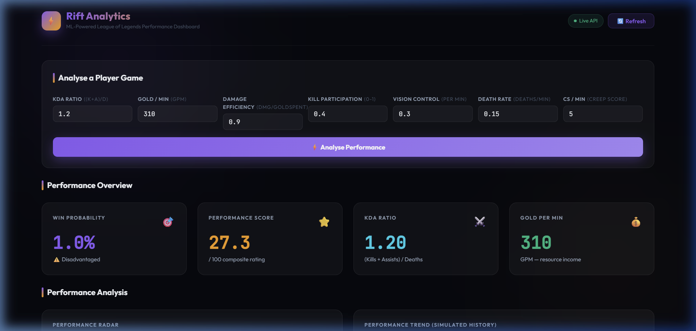
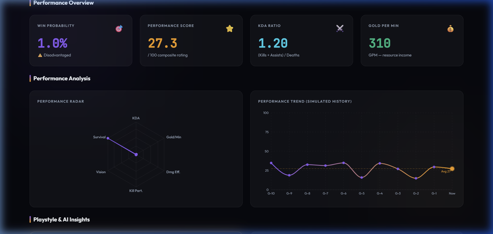
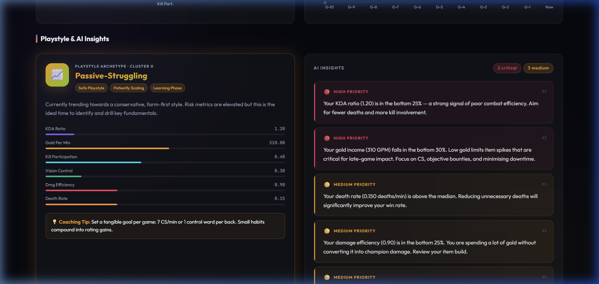

# Rift Analytics ⚡🎮

A full-stack data science & machine learning portfolio project that analyzes League of Legends ranked match data to provide players with actionable, AI-driven performance insights.



## What is it?
Rift Analytics is a machine learning pipeline and interactive dashboard that evaluates a player's performance in a given League of Legends match. By ingesting over 180,000 participant records and 20+ engineered features across 18,000 matches, the system trains a suite of ML models to understand what wins games.

When a user submits their post-game stats, Rift Analytics runs three models simultaneously:
1. **Win Predictor (XGBoost)**: Calculates the absolute mathematical probability of winning based on those stats. 
2. **Performance Scorer (Regression)**: Generates a 0-100 normalized composite rating of the player's true map impact.
3. **Playstyle Clusterer (KMeans)**: Classifies the player into 1 of 5 behavioral archetypes (e.g., *Aggressive Carry*, *Vision-Dominant*, *Passive-Struggling*).

Finally, an Insight Engine combines algorithmic feature importance with rule-based percentile thresholds to generate prioritized, natural-language coaching feedback ("Why You Lost / Why You Won").

## Why I Built It
I built this project to demonstrate a complete, end-to-end data product lifecycle. Many data science portfolios stop at the Jupyter Notebook step. I wanted to build something that takes raw, messy data, cleans it, trains predictive models, and actually *serves* those predictions via a production-style REST API to a modern front-end dashboard.

## Key Features
- **Data Engineering**: Merges 7 disjoint CSVs into a cleaned, engineered dataset, handling missing values, duration anomalies, and champion metadata mappings.
- **Advanced EDA**: Deep-dive statistical analysis and visualizations of League of Legends game theory (e.g., vision score vs win rate, KDA distributions).
- **ML Modeling**: Classification (Logistic Regression, Random Forest, XGBoost), Regression, and Unsupervised Clustering (K-Means).
- **Insight Engine**: A custom recommendation engine bridging statistical models and human-readable feedback.
- **RESTful API**: A fast, asynchronous backend powered by FastAPI that loads serialised `.pkl` models into memory.
- **Live Dashboard**: A responsive, dark-mode React application featuring glassmorphism design, interactive Recharts (Radar & Line), and real-time inference.



## Tech Stack
| Layer | Technologies |
|---|---|
| **Data Science & ML** | Python 3, Pandas, NumPy, Scikit-learn, XGBoost, Matplotlib, Seaborn |
| **Backend API** | FastAPI, Uvicorn, Joblib, Pydantic |
| **Frontend** | React (Vite), Axios, Recharts, Vanilla CSS |

## Architecture

```
rift-analytics/
├── data/            ← Raw & processed datasets
├── notebooks/       ← 01-06 Jupyter notebooks (Data Cleaning to Insights)
├── models/          ← Exported .pkl model artefacts
├── backend/         ← FastAPI REST API exposing /predict
└── frontend/        ← React dashboard (Vite)
```

## Setup & Local Development

### 1. Backend (FastAPI)
```bash
cd backend
pip install -r requirements.txt
uvicorn main:app --reload --port 8000
```

### 2. Frontend (React/Vite)
```bash
cd frontend
npm install
npm run dev
```

The application will be running at `http://localhost:5173`.

## Screenshots

**1. AI Coaching Insights & Prioritization**


## What I Learned
Through building this project, I gained practical experience in:
- **Full-Stack ML Integration**: Bridging the gap between `.ipynb` environments and live application servers. Handling data types and shapes between pandas DataFrames and JSON REST requests was a major learning curve.
- **Actionable AI**: Models predicting a number (like a 34% win rate) aren't always helpful to users. Building the Insight Engine taught me how to combine ML feature importances with deterministic rules to give *actionable* advice.
- **Dealing with Messy Joins**: The dataset required complex joins across 7 tables, including fuzzy mapping of outdated Champion IDs to a modern 2024 Champion metadata dataset.
- **Frontend Data Viz**: Translating raw JSON predictions into visually compelling React components, specifically mapping 6 dimensions onto a normalized 0-100 scale for generating accurate Radar Charts.

## Project Completion Status
- [x] Phase 0 — Project scaffolding
- [x] Phase 1 — Data cleaning
- [x] Phase 2 — EDA
- [x] Phase 3 — Feature engineering
- [x] Phase 4 — Model training
- [x] Phase 5 — Playstyle clustering
- [x] Phase 6 — Insight generation
- [x] Phase 7 — FastAPI backend
- [x] Phase 8 — React frontend dashboard
- [x] Phase 9 — Final Polish & Documentation

---
*Built by Rayan — League of Legends analytics portfolio project, April 2026*
